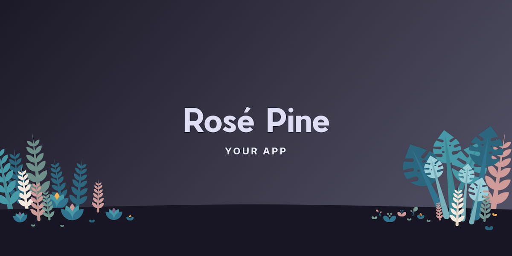

Rosé Pine Images is a simple social media preview generator for [Rosé Pine](https://rosepinetheme.com). I adapted this tool for Rosé Pine from Vercel's [Open Graph Image as a Service](https://github.com/vercel/og-image) to help foster a common design language among theme projects and ease the process of contribution for creators. It's also a sneaky way to plant copies of my novice illustrations across GitHub in preparation for artistic world-domination (don't tell anyone).

This project was a technical exercise in reading unfamiliar code, adding features without compromising existing functionality, and generally co-opting an upstanding project for my own diabolical plans.

## Links

- [Live Site](https://rose-pine-images.vercel.app)
- [GitHub](https://github.com/fvrests/rose-pine-images)

## Utilities

- Site hosted with [Vercel](https://vercel.com/)
- UI Spinners from Tobias Ahlin's [Spinkit](https://tobiasahlin.com/spinkit/)

## Templates

Customization options include a selection of three basic themes, as well as an input for the app name (shown here: `YOUR APP`).

### Rosé Pine



### Rosé Pine Moon


### Rosé Pine Dawn


## Snippets

Because the image preview in this project takes a moment to generate, I wanted to add an animation in its place to signal a loading state and visually fill the space where the image would appear. I had come across [Spinkit](https://tobiasahlin.com/spinkit/) and after overcoming the inevitable entrancement caused by gently floating shapes, I decided to try adding it to my site for that extra dosage of hypnotic <i lang="fr">je ne sais quoi</i>.

The code below shows the demonstrated implementation from Spinkit, which looked simple to add to a typical codebase.

```html
<div class="spinner">
	<div class="bounce1"></div>
	<div class="bounce2"></div>
	<div class="bounce3"></div>
</div>
```

Reader, I think you can predict that it turned out not to be so simple. In my case, the component would need to be rendered in the unfamiliar (to me) html-disguised-as-typescript syntax used to specify the site frontend, which is mostly composed of code like this:

```ts
return H(
	'div',
	{ className: 'stack' },
	H(
		'div',
		H(
			'div',
			H(Field, {
				label: 'Theme',
				input: H(Dropdown, {
					options: themeOptions,
					value: theme,
					onchange: (val: Theme) => {
						setLoadingState({ theme: val });
					},
				}),
			})
		)
	)
);
```

Despite feeling unfamiliar with (and slightly disturbed by) the syntax of the file, I realized that each instance of `H()` seemed to define a nestable element with the specified HTML tag, and allowed details such as `className` to be passed from within an object. According to this model, I produced the below fragment which, while somewhat abominable, creates the desired element.

```ts
H(
	'div',
	{ className: 'spinkit' },
	H(
		'div',
		{ className: 'spinner' },
		H('div', { className: 'bounce1' }),
		H('div', { className: 'bounce2' }),
		H('div', { className: 'bounce3' })
	)
);
```

All that was left was to add the provided styles to the public `style.css` file and ensure that they targeted the `className` values I assigned, and the rest worked as intended.

Even though this excerpt definitely looks different than the example Spinkit provided, writing it turned out to be a reasonable undertaking once I understood how the structure of Vercel's frontend was analogous to garden-variety HTML. This experience taught me to hunt for clues in the hierarchy, language & layout of code, even when faced with the incomprehensible mysteries of wild-caught markup.
