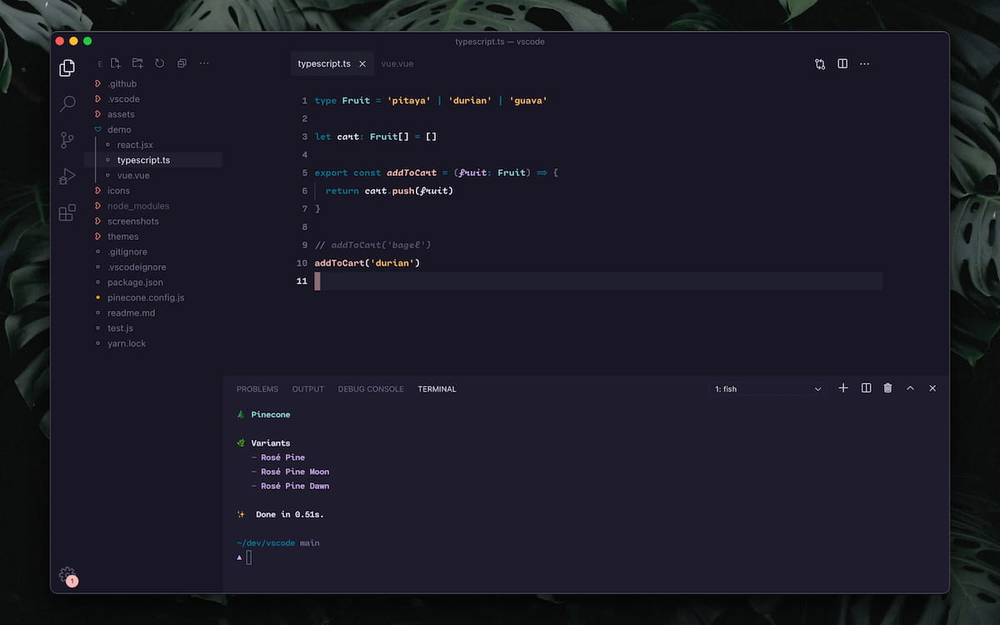
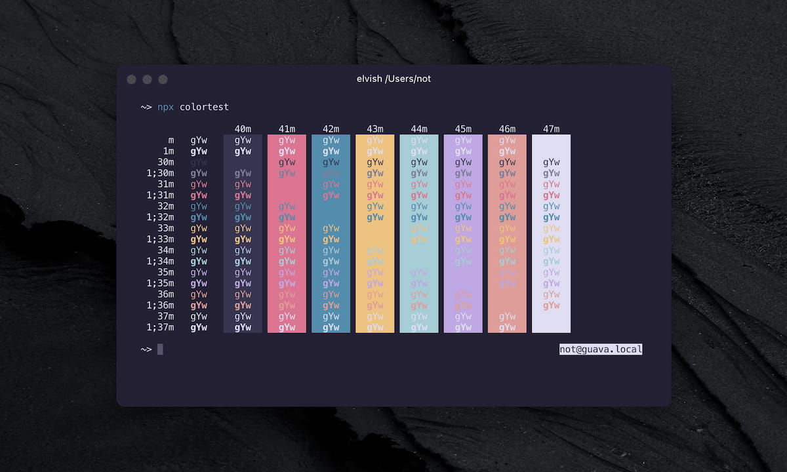
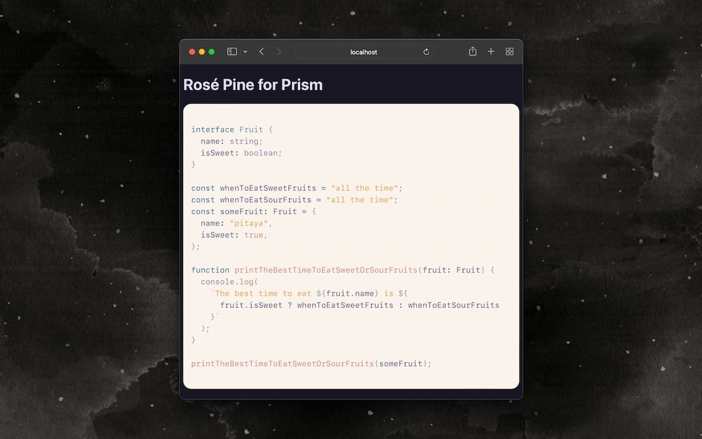
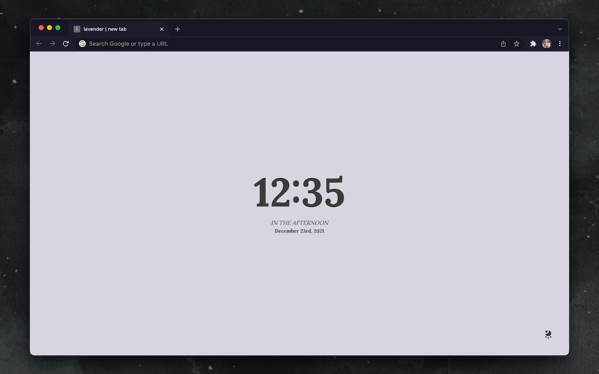
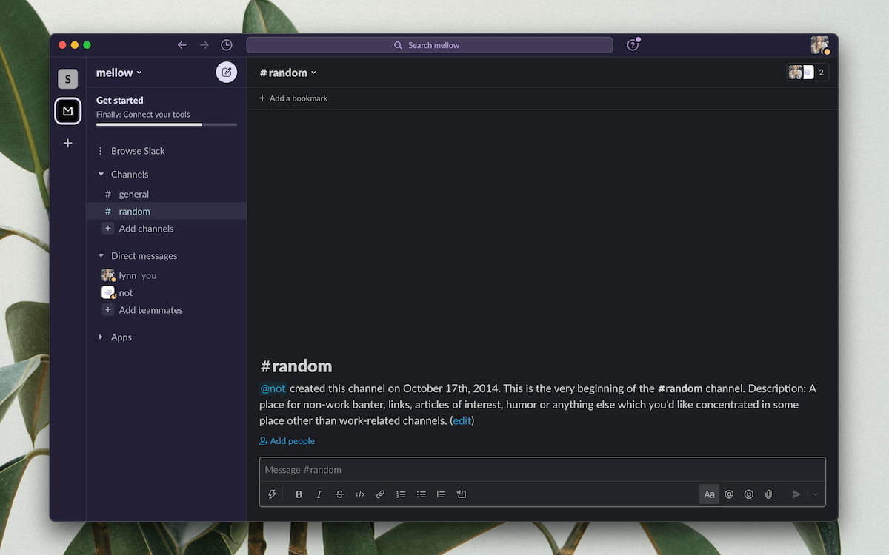

Rosé Pine is a theme project with support for over 100 platforms. I tinker when I'm able amongst wiser and braver souls -- [@mvllow](https://mellow.dev) and a growing community of contributors -- to maintain themes and documentation for the organization.

In the context of the web theming space, Rosé Pine's palette tends toward calming and moody colors, with an adaptible nature well-suited to varying applications. Its three variants reduce eyestrain in diverse light conditions, with loose design inspiration from [Solarized](https://ethanschoonover.com/solarized/) and other light-accommodative themes.

Owing to the caring and generous efforts of a growing open-source community, Rosé Pine has become an encouraging medium through which contributors can learn about code & theme building.

## Links

- [Theme website](https://rosepinetheme.com)
- [GitHub](https://github.com/rose-pine/rose-pine-theme)

## Contributions

- Co-authored the first Rosé Pine theme, [Rosé Pine for VSCode](https://github.com/rose-pine/vscode)
- Designed & implemented the [Dawn variant](https://rosepinetheme.com/palette/ingredients#dawn-ingredients) for bright conditions
- Contributed themes for [Hyper](https://github.com/rose-pine/hyper), [Prism](https://github.com/rose-pine/prism), [Google Chrome](https://github.com/rose-pine/google-chrome) & [Slack](https://github.com/rose-pine/slack)
- Development and maintenance of [Rosé Pine Images](/projects/rose-pine-images), a social image generator for project repositories
- Ongoing work in asset, color, & organizational design

## Gallery

> Selected contributions

<figure>

<figcaption>Rosé Pine for Visual Studio Code — <a href="https://github.com/rose-pine/vscode">source</a></figcaption>

</figure>

 

<figure>

<figcaption>Rosé Pine Moon for Hyper — <a href="https://github.com/rose-pine/hyper">source</a></figcaption>

</figure>

 

<figure>

<figcaption>Rosé Pine Dawn for Prism — <a href="https://github.com/rose-pine/prism">source</a></figcaption>

</figure>

 

<figure>

<figcaption>Rosé Pine for Google Chrome — <a href="https://github.com/rose-pine/google-chrome">source</a></figcaption>

</figure>

 

<figure>

<figcaption>Rosé Pine Moon for Slack — <a href="https://github.com/rose-pine/slack">source</a></figcaption>

</figure>
